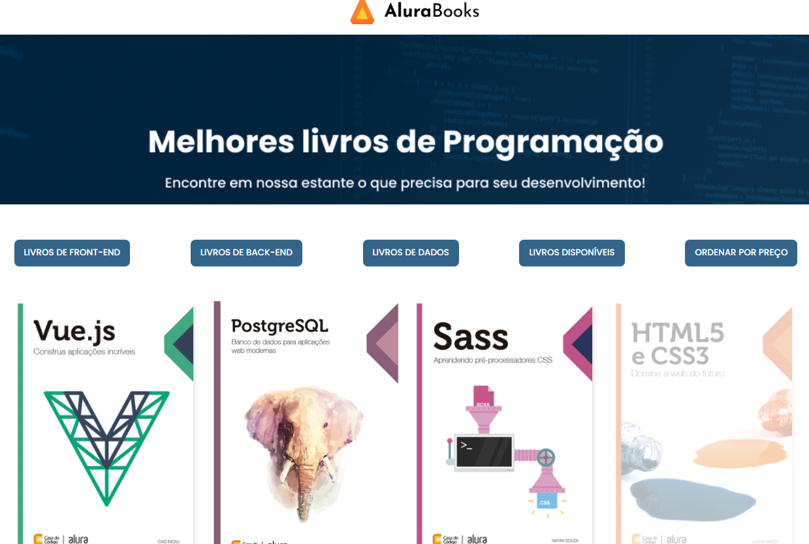

# AluraBooks

#### O AluraBooks é um projeto que utiliza uma API para obter uma lista de livros e exibi-los na tela.

## 📸 Fotografia

# 🔨 Funcionalidades do projeto

## O usuário será capaz de:

- Filtrar os conteúdo dos livros
- Acessar somente os livros disponíveis
- Gerar o valor total dos livros disponibilizados
- Ordenar por preço

## ✔️ Tecnologias utilizadas

- HTML5
- CSS
- JavaScript 
- API de livros